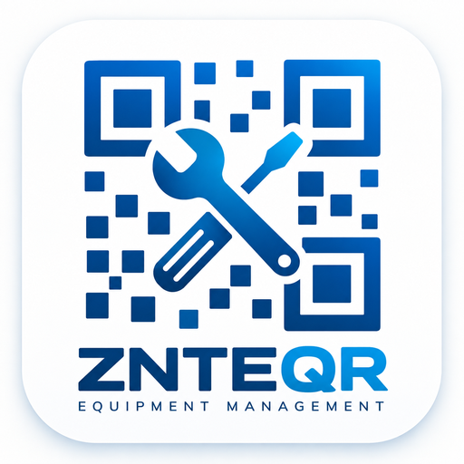

<div align="center">

# Equipment Management by Phan Tan




</div>

---

## Overview

**ZNTEQR** is a QR-based equipment management and maintenance web application by Phan Tan, built with React, TypeScript, Vite and Supabase.

The system is designed for managing equipment records, QR-code access, maintenance activities, work orders, teams, inventory and related operational data from one interface.

## Main Features

- QR code access to equipment records
- Equipment registration and management
- Work order creation, assignment and tracking
- Preventive maintenance workflows
- Equipment notes, images and maintenance history
- Organization and team-based access control
- Inventory and spare-parts management
- Equipment location and scan history
- Realtime updates through Supabase
- Responsive web interface for desktop and mobile use

## Technology Stack

- **Frontend:** React + TypeScript
- **Build tool:** Vite
- **UI:** Tailwind CSS + Radix UI
- **Backend / Database:** Supabase
- **Authentication:** Supabase Auth
- **Realtime:** Supabase Realtime
- **Storage:** Supabase Storage

## Requirements

- Node.js version compatible with `engines.node` in `package.json`
- npm
- A Supabase project

## Installation

Clone this repository:

```bash
git clone https://github.com/phan-tan-7211/Equipment-Management.git
cd Equipment-Management
```

Install dependencies:

```bash
npm install
```

## Supabase Configuration

This repository is currently configured to work with Supabase project:

```text
wgynakhoppqkrutnslmv
```

Link the local project to Supabase:

```bash
npx supabase link --project-ref wgynakhoppqkrutnslmv
```

Apply database migrations:

```bash
npx supabase db push --include-all
```

For a fresh development database with the included demo seed data, use the Supabase seed files under `supabase/seeds` according to your development workflow.

## Environment Variables

Create a `.env.local` file in the project root:

```env
VITE_SUPABASE_URL=https://wgynakhoppqkrutnslmv.supabase.co
VITE_SUPABASE_ANON_KEY=YOUR_SUPABASE_PUBLISHABLE_KEY
```

Do not commit private or service-role keys to GitHub.

Additional optional integrations may require more environment variables. See `.env.example` for the complete list.

## Run Development Server

```bash
npm run dev
```

Vite normally starts on:

```text
http://localhost:8080
```

If that port is already in use, Vite will automatically choose another available port.

## Build

```bash
npm run build
```

## Type Check

```bash
npm run type-check
```

## Demo / Development Login

Development mode includes test accounts for testing different permission levels such as Owner, Admin, Technician and Viewer.

The repository contains development seed files for demo organizations, users, teams, equipment and work orders under:

```text
supabase/seeds/
```

These accounts and seed data are intended for development/testing only and should not be treated as production accounts.

### Dev Quick Login — bật / tắt sau này

File điều khiển chính:

```text
src/components/auth/DevQuickLogin.tsx
```

Dev Quick Login được phép hiển thị khi ứng dụng đang chạy ở Vite development mode (`import.meta.env.DEV`) hoặc khi biến môi trường dưới đây được bật:

```env
VITE_PREVIEW_QUICK_LOGIN=true
```

Để tắt ở preview/production, đặt:

```env
VITE_PREVIEW_QUICK_LOGIN=false
```

hoặc xóa hoàn toàn biến `VITE_PREVIEW_QUICK_LOGIN` khỏi `.env`, `.env.local` và Environment Variables của nền tảng deploy.

Lưu ý: khi chạy `npm run dev`, `import.meta.env.DEV` là `true`, nên Dev Quick Login vẫn có thể xuất hiện dù `VITE_PREVIEW_QUICK_LOGIN=false`. Biến `VITE_PREVIEW_QUICK_LOGIN` chủ yếu dùng để cho phép/tắt Quick Login ở preview hoặc build không phải development.

Khi chuẩn bị production, kiểm tra lại:

```text
1. Không đặt VITE_PREVIEW_QUICK_LOGIN=true trên server deploy.
2. Kiểm tra src/components/auth/DevQuickLogin.tsx nếu muốn khóa chặt chỉ cho localhost.
3. Không sử dụng tài khoản demo/test làm tài khoản production.
```

## Project Structure

```text
src/                 React application
supabase/migrations/ Database migrations
supabase/seeds/      Development/demo seed data
supabase/functions/  Supabase Edge Functions
public/              Static assets
docs/                Project documentation
dev/                 Development scripts and utilities
```

## Security

- Keep Supabase service-role keys and third-party API secrets out of the frontend.
- Use only the Supabase publishable/anon key in Vite client environment variables.
- Review Row Level Security policies before production deployment.
- Demo credentials and development shortcuts should be disabled or removed for production environments.

## Repository

GitHub: `phan-tan-7211/Equipment-Management`

## Project Name

**ZNTEQR — Equipment Management by Phan Tan**
